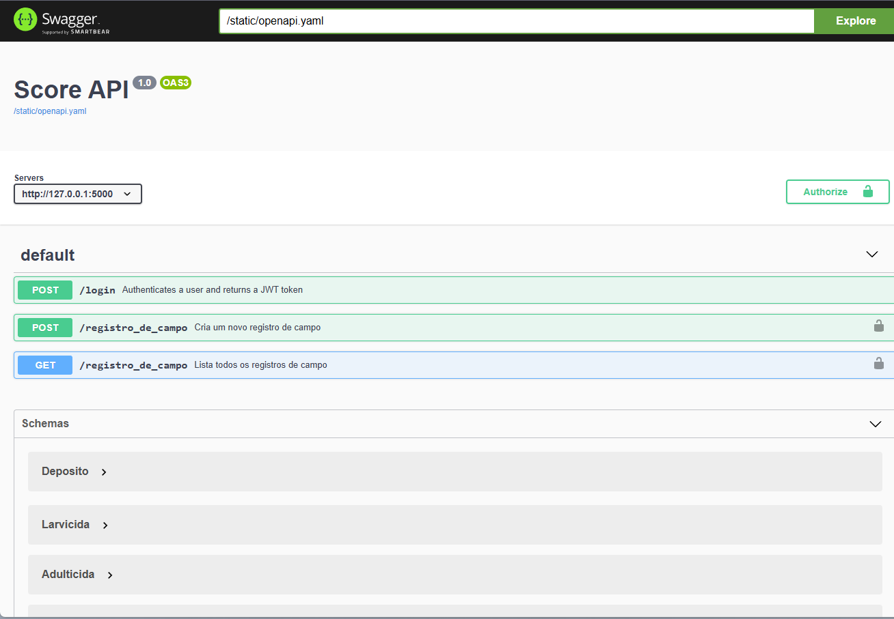

# 📌 Como rodar o projeto

## 1 - Instale o Docker Descktop:

[https://www.docker.com/](https://www.docker.com/)

## 2. Clone o repositório
```bash
git clone <link-do-repositorio>
cd <nome-da-pasta>
```

## 3. Crie as imagems (flask + postgres)
```bash
docker-compose build
```

## 3. Inicie o peojeto
```bash
docker-compose up
```

## A API será iniciada e estará disponível em:

[http://localhost:5000](http://localhost:5000)


## Documentação da API
[http://localhost:5000/api/docs](http://localhost:5000/api/docs)


<!-- #  Como rodar o projeto

## 1. Instale o Python
- Baixe e instale o Python no site oficial: 

---

## 2. Clone o repositório
```bash
git clone <link-do-repositorio>
cd <nome-da-pasta>
```

---

## 3. Crie um ambiente virtual
Na pasta do projeto, execute:
```bash
python -m venv venv
```

### Ative o ambiente virtual
- **Windows (PowerShell ou CMD):**
  ```bash
  venv\Scripts\activate
  ```
- **Linux / macOS:**
  ```bash
  source venv/bin/activate
  ```

---

## 4. Instale as dependências
```bash
pip install -r requirements.txt
```

---

## 5. Inicie a API
```bash
python app.py
```

A API será iniciada e estará disponível em:
```
http://localhost:5000
``` -->